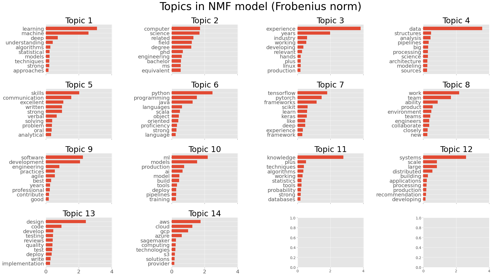
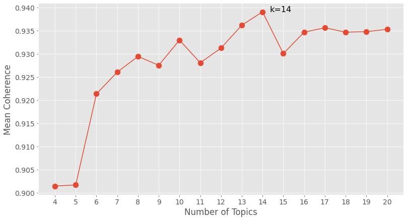

# SkillSurf

## Overview
SkillSurf is a machine learning tool that helps job seekers and professionals identify the most important skills and phrases for a specific position title. By scraping job descriptions from popular job boards and applying natural language processing techniques, SkillSurf produces a list of key topics and skills that are most commonly associated with a given job title. These topics and skills can be used to guide career development, inform job searches, and identify areas for improvement. Whether you're looking to land your dream job or advance your career, SkillSurf can help you identify the skills and knowledge you need to succeed.

## Methods and Results
1. Compile the skills text into a corpus after scraping indeed for job title
2. Text vectorization into numerical feature vectors using term frequency inverse document frequency  
   1. term frequency * inverse document frequency 
   2. Words very frequently occurring in the corpus approach 0, infrequent words approach 1 
   3. UNORDERED vector (e.g., dog has bone == bone dog has)
3. Non-negative matrix factorization which produces `k` components with `W` weights, the factorization of the input data `N x M`, e.g., `N x M -> W x k * k x N`
4. Train a w2v model using the corpus for benchmarking
5. Within each NMF cluster (e.g., each topic) average the w2v similarity ranking between each combination of words to calculate a ‘topic coherence’ 
   1. mean topic coherence within each topic, and compute a mean coherence for the model across all topics

### (1) Webscraping
The webscraper uses BeautifulSoup to parse content from the online job board Indeed. Indeed.com allows for a number of 
search filters, but for this example only 3 are used. A search string (Machine Learning Engineer), a location (United States),
and the number of jobs returned per page (50).

```python
from webscraper import Dataset

# Compile a list of URLs for N job postings
N=500
urls = []
title = 'Machine+Learning+Engineer'
for start in range(0, N, 50):
    urls.append("https://www.indeed.com/jobs?q="+title+"&l=United+States&limit=50&start=" + str(start))

# parsing the html and store skills in csv
data = Dataset(URLS=urls)
data.populate_skills_dict()
data.preprocess_skills_dict()
data.save_csv("skills_dictionary_ML.csv")
```

### (2-3) Topic Modeling

Compute term frequency-inverse document frequency for the entire corpus

```python
from sklearn.feature_extraction.text import TfidfVectorizer

n_samples = 3000
n_features = 1500
n_components = 10
n_top_words = 10
data_samples = data._skills[:n_samples]

# term frequency–inverse document frequency 
tfidf_vectorizer = TfidfVectorizer(max_df=0.95, min_df=2,
                                   max_features=n_features,
                                   stop_words='english')

tfidf = tfidf_vectorizer.fit_transform(data_samples)
tfidf_feature_names = tfidf_vectorizer.get_feature_names()
```

Compute the non-negative matrix factorization 

```python
from sklearn.decomposition import NMF
topic_models = []
kmin = 4
kmax = 20
# assess model accuracy using 4-20 topic clusters
for k in range(kmin, kmax+1):
    print("Applying NMF for k=%d ..." % k )
    # Non-Negative Matrix Factorization
    # https://scikit-learn.org/stable/modules/decomposition.html#nmf
    model = NMF(n_components=k, random_state=1, alpha=.1, l1_ratio=.5, init="nndsvd")
    W = model.fit(tfidf)
    H = model.components_    
    # 
    topic_models.append( (k,W,H) )
```

### (4-5) Benchmarking and Evaluation

Train word2vec model on corpus

```python
from sklearn.feature_extraction import text
import gensim

#tokens from skill text
docgen = TokenGenerator( data._skills, text.ENGLISH_STOP_WORDS )

#w2v model
model = gensim.models.Word2Vec(sentences=docgen, # Iterable for the tokenized text data
                               vector_size=200, # Dimensionality of the word vectors 
                               min_count=2,  # Ignores all words with total frequency lower than this 
                                             # (small dataset, so use 0)
                               sg=1) # Training algorithm: 1 for skip-gram; otherwise CBOW
```

Calculate topic coherence 

```python
k_values = []
coherences = []
for (k,W,H) in topic_models:
    term_rankings = []
    for topic_index in range(k):
        term_rankings.append( get_descriptor( tfidf_feature_names, H, topic_index, n_top_words ) )
    # Now calculate the coherence based on w2v model
    k_values.append( k )
    coherences.append( calculate_coherence( model, term_rankings ) )
    print("K=%02d: Coherence=%.4f" % ( k, coherences[-1] ) )
```

#### Example topics in job skill corpus with token length of 1


#### Model Coherence for varying number of Job Skill Topics

